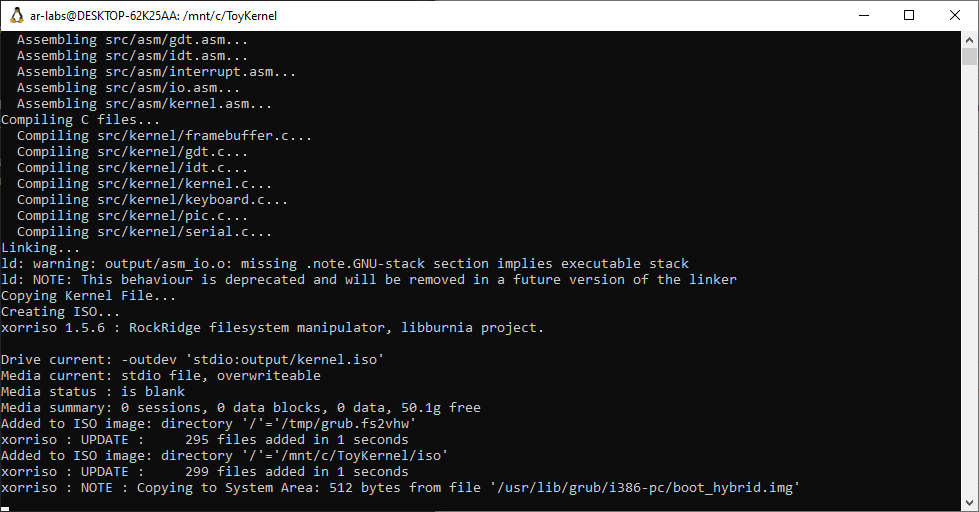
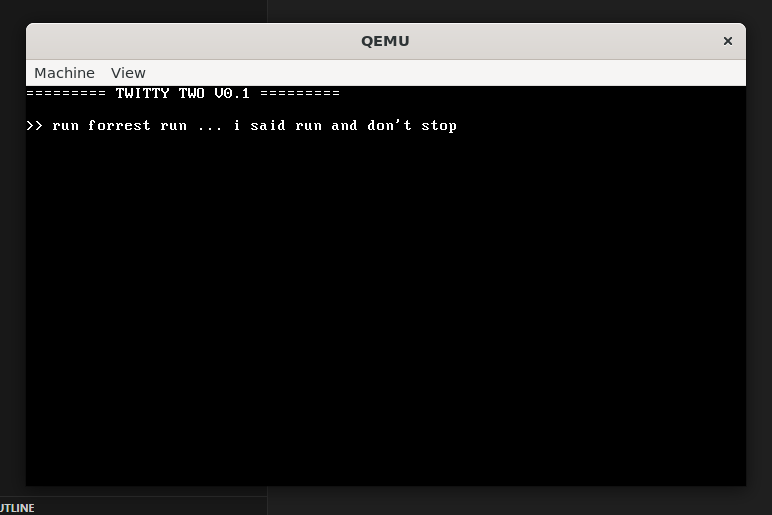
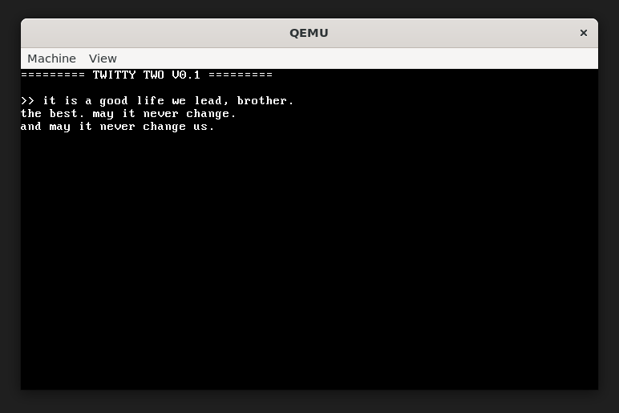

# itBoots

A minimal 32-bit x86 kernel that I wrote (honestly, Sir… Sir), for learning kernel internals such as GDT, IDT, interrupts, VGA, and serial (though I didn't really use the serial part). Not a real kernel.

My curiosity keeps making me wander around these ancient low-level parts, but I want to see how a kernel works by learning its components. This project is a hobby project that I completed in a week (I told myself not to use any LLM at all, except for parts where I was stuck for hours with no lead).

### Right now it does the following:
1. Boots using QEMU (GRUB as the bootloader)  
2. Prints something on the screen  
3. Allows you to write through the keyboard  
4. Refuses to elaborate  
5. You quit because you also refuse to elaborate

### Build instructions ... Not really necessary

### Here are some images for you

